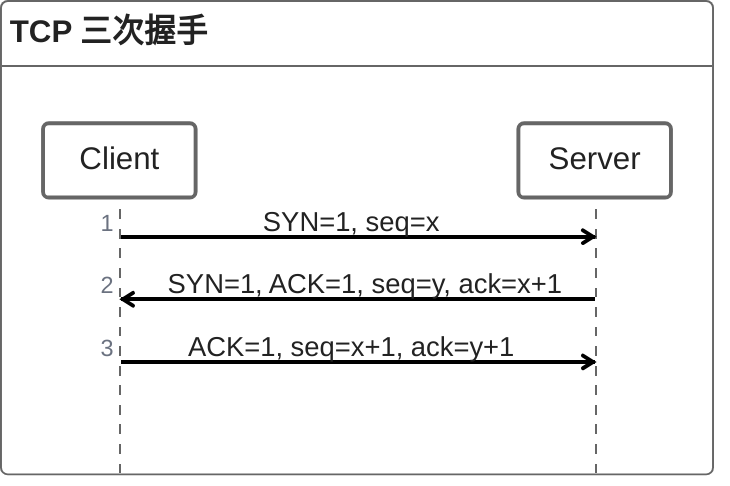

# 计算机网络

## TCP

### TCP 三次握手



#### 为什么需要第三次握手？

设想如下场景：由于网络问题，Client 发送的第一次握手迟迟没有送达 Server，也就是迟迟没有收到回应，那么 Client 就会重新发送一个新的握手请求，而 Server 可能会先后接到这两次握手请求，Server 知道的信息很有限，它并不知道这两次是否是两个不同的连接建立请求，所以均会进行第二次握手，如果没有第三次握手，那么就会建立两个 TCP 链接，但只有一个会被使用，这就是链接的浪费

为此，TCP 设计了第三次握手，由 Client 发送，这是因为 Client 有足够的信息知道哪个链接是历史链接，这是因为每次的初始 seq 不同，Client 会记住此次的 seq，对于历史连接，可以通过 Server 发送的第二次握手的 ack 来判断，可以判断是否要创建这个连接，所以，TCP 连接的建立权最终是在 Client 手中，只有 Client 发送了第三次握手，这个 TCP 连接才会建立

### TCP 四次挥手


第一次挥手：Client 通过 FIN 通知服务器要关闭连接

第二次挥手：Server 告知 Clietn 接收到了第一次挥手

第三次挥手：Server 通过 FIN 告知 Client 可以关闭连接，并发送最后的一些数据给 Client

第四次挥手：Client 确认关闭连接的准备工作都已完成，告知服务器可以关闭连接了

#### 为什么需要第三次挥手？

因为在接收到 Client 的 FIN 后，Server 可能还有一些数据需要进行发送，可能还要一些处理时间，所以，发送 FIN 的控制权在 Server 手中，只有被关闭连接的应用程序调用的系统的关闭连接的函数之后，才会发送 FIN

#### 可否合并为三次挥手？

对于第二次和第三次挥手，都是由 Server 发送，所以，当 Server 没有剩余数据需要发送，同时开启了 TCP 延迟确认机制的情况下，这两次挥手会合并为一次挥手发送

TCP 延迟确认机制：在发送 ACK 时，若不需要发送响应数据，则 TCP 会延迟一段时间，等待后续是否有响应数据一起进行发送，用来提升 ACK 的传输效率，区别于累计确认

#### 为什么需要等待 2MSL？

因为 Client 需要确认服务器已经接收到第四次挥手了

确认的方法，就是在 2MSL 内没有再收到服务器发送的包，这 2MSL，第一个是第四次挥手的包发送到 Server 的最大存活时间，第二个是假如 Server 没有收到第四次挥手，其会重发第三次挥手，这个重发的包的最大存活时间也是 1MSL

也就是说，如果第四次挥手发送失败，则一定会在 2MSL 内收到 Server 重发的包

### TCP 粘包问题

#### 为什么会有粘包问题

由于 TCP 是面向字节流的协议，所以应用层给 TCP 的数据，并不以消息为单位进行发送（与 UDP 不同），而是拆分后加入一个个数据段中，整段进行发送（Nagle算法），这就导致当发送数据小于数据段长度时，会和其他的包组合在一起发送，此时，接收方将无法从中拆分

#### 如何解决粘包问题

在应用层进行边界划分，主要有两种方式

1. 基于长度：在消息头中，加入消息的长度，在接收时，获取足够长度的信息后，即可进行划分
2. 基于终止符：在发送的消息的结尾写入固定的终止符来作为结束标记，在接收时即可通过这个标记来划分包

##### HTTP 的做法

分析一下 HTTP 的请求格式

```
Get /.../index.html HTTP/1.1\r\n
Host: 123.123.123.123\r\n
......
Content-Length: xxx\r\n
\r\n
......
```

可以看到有如下两个特点：

1. 每一行结尾为 `\r\n`，请求头后多一行 `\r\n`
2. 存在 Content-Length

由此，可以发现 HTTP 同时采用了上述的两种解决方案，一是通过 `\r\n` 作为终止符，来划分请求头和请求体，二是通过 `Content-Length` 来指明请求体的长度，由此来解决粘包问题